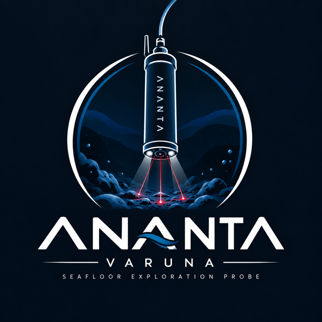
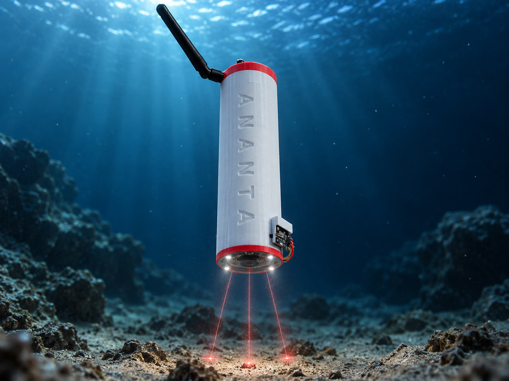
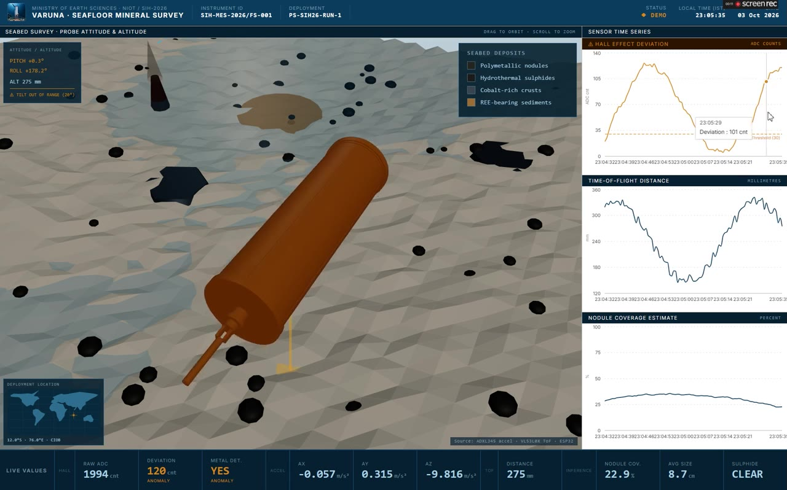
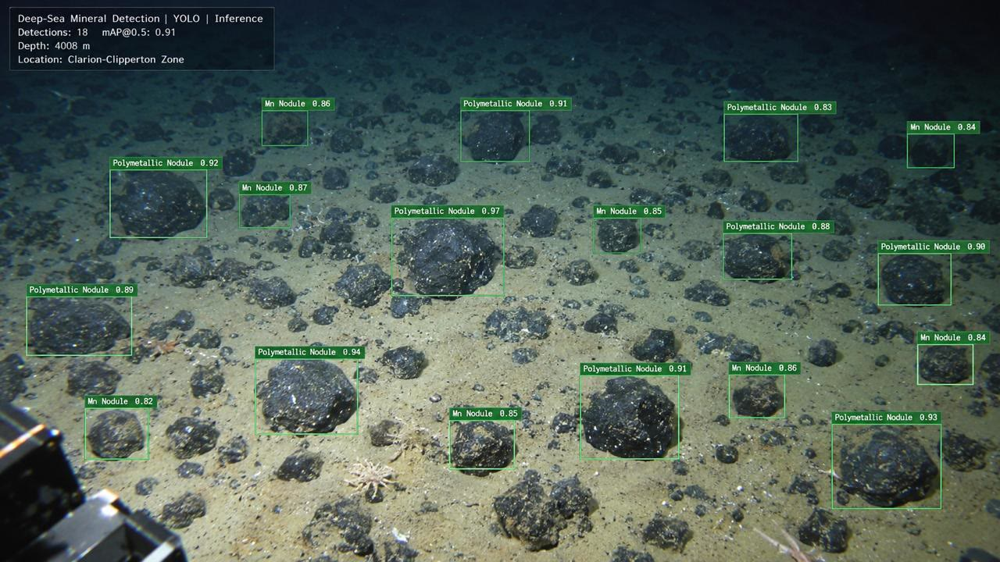
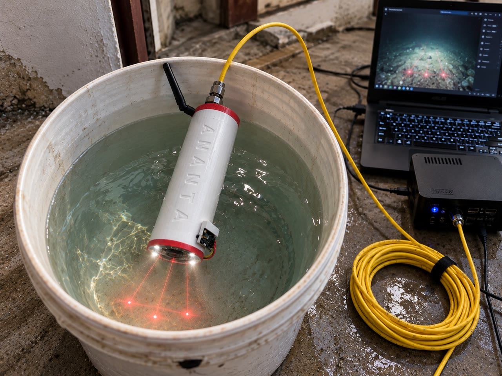
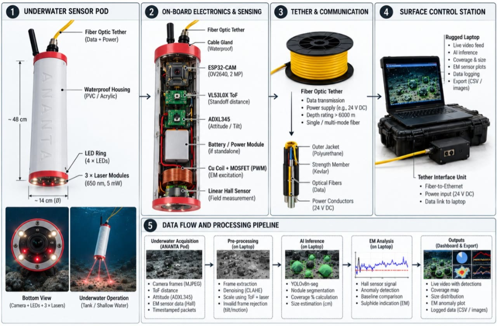

<div align="center">



# VARUNA

### Screen first. Then dive.

**A tethered, low-cost probe that screens the seabed for critical-mineral deposits — _before_ you spend a fortune on an AUV or ROV dive.**

[](https://vatsalyaaa.me/Varuna-Probe/)
[](https://vatsalyabhadaurya.github.io/Varuna-Probe/)
&nbsp;


<br/>



</div>

---

## 🌊 The problem

India just commissioned **ORV Sagar Manthan — an ₹840-crore research vessel** built to survey the deep seabed for critical metals like polymetallic nodules and rare-earth elements.

Every AUV/ROV dive from a ship like this is **slow and extremely expensive**. The hard question isn't *how* to dive — it's **where** to dive.

> **VARUNA answers that.** It's a cheap, tethered screening probe (**under ₹10,000**) that surveys candidate zones first, so costly deep-sea assets are only deployed where minerals are actually likely.

---

## 🛰️ Meet VARUNA

VARUNA fuses **three sensing layers** into a single pass over the seafloor:

- **👁️ Computer vision** — an ESP32-CAM streams the seafloor; a **YOLOv8n-seg** model marks every nodule and computes **coverage %**.
- **🧲 Electromagnetic sensing** — an electromagnet + Hall sensor detect how metal-bearing material distorts a known field (EM anomaly vs. a rolling baseline).
- **📡 Real-time telemetry** — tilt, altitude and range are streamed live to a topside dashboard, with motion/tilt gating so only clean frames count.

A **650 nm laser** + **VL53L0X time-of-flight** sensor turn raw pixels into real **centimetres**, and an **ADXL345** accelerometer rejects frames captured while the pod is tilted or moving.

<div align="center">

### 🚀 Try the live dashboard

<a href="https://vatsalyaaa.me/Varuna-Probe/"></a>

**[vatsalyaaa.me/Varuna-Probe](https://vatsalyaaa.me/Varuna-Probe/)** &nbsp;·&nbsp; **[GitHub Pages mirror](https://vatsalyabhadaurya.github.io/Varuna-Probe/)**

</div>

---

## 📸 See it in action

**Live mission dashboard** — 3D probe attitude & altitude over an animated seabed, EM-anomaly / ToF / nodule-coverage charts, and a deployment world-map inset.

<div align="center">

</div>

<table>
<tr>
<td width="50%" align="center">
<b>YOLOv8n-seg · nodule coverage</b><br/>

</td>
<td width="50%" align="center">
<b>Probe in a controlled tank test</b><br/>

</td>
</tr>
<tr>
<td colspan="2" align="center">
<b>Technical architecture</b><br/>

</td>
</tr>
</table>

---

## ✅ What works today — and what's next

| Deposit | Sensing method | Status |
| --- | --- | :---: |
| Polymetallic nodules | Vision (YOLOv8n-seg) | 🟢 **Working** |
| Hydrothermal sulphides | Electromagnetic | 🟢 **Working** |
| Cobalt-rich crusts | Acoustic backscatter | 🟡 Next stage |
| Rare-earth sediments | Radiometric proxy | 🟡 Next stage |

> Nodules and sulphides are detected **today**. Cobalt crusts and rare-earth sediments need acoustic and radiometric sensing — **already architected** as the next stage.

---

## 🔩 Hardware — under ₹10,000

| Module | Role |
| --- | --- |
| **ESP32-CAM** | Controller + camera; streams frames to the topside laptop |
| **650 nm laser** | Projects a scale-reference dot into every frame |
| **VL53L0X** | Time-of-flight range to the seabed (pixels → centimetres) |
| **ADXL345** | Accelerometer; tilt / motion frame-gating |
| **Electromagnet + Hall sensor** | EM-anomaly layer for metal-bearing material |
| **Acrylic tube, O-ring sealed** | Pressure housing holding the printed sensor mounts |

Built in India, trained on open data.

---

## 🧱 Tech stack

- **Firmware:** C++ / Arduino on ESP32-CAM (`firmware/firmware.ino`)
- **Inference:** Python · YOLOv8n-seg (`firmware/inference_server.py`)
- **Dashboard:** React + Vite + **three.js** (react-three-fiber) + Recharts
- **Deploy:** GitHub Actions → GitHub Pages

---

## 📁 Repository layout

```
firmware/
├── firmware.ino           # ESP32 probe firmware (Hall, ADXL345 accel, VL53L0X ToF)
├── inference_server.py    # On-shore inference server (YOLOv8n-seg)
├── Powerful Jaiks.stl     # Probe mechanical model
└── dashboard/             # Web mission dashboard  ← the deployed site
docs/images/               # README media
```

---

## 🏁 Getting started

```bash
cd firmware/dashboard
npm install
npm run dev      # local development  → http://localhost:5173
npm run build    # production build    → dist/
```

The dashboard ships in **demo mode** (simulated telemetry), so it runs with no hardware attached. It's fully responsive — works on desktop and mobile.

---

<div align="center">

**VARUNA** · _Screen first. Then dive._

Team **Ananta2** · Problem **SIH26064** · Smart India Hackathon 2026
Ministry of Earth Sciences / NIOT

</div>
